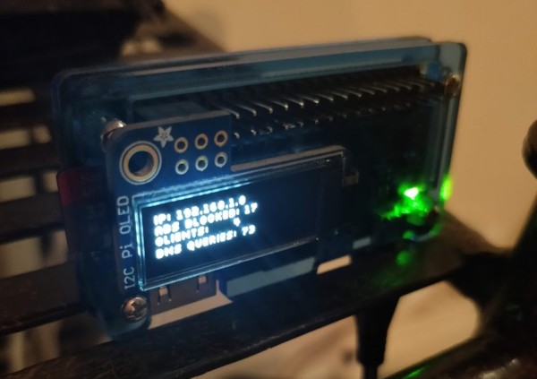

# raspi-zero-pihole
Ansible playbook(s) for setting up [Pi-hole](https://github.com/pi-hole/pi-hole), [dnscrypt-proxy](https://github.com/DNSCrypt/dnscrypt-proxy) and optionally [pioled](https://www.adafruit.com/product/3527), running on Docker on Raspbian on Raspberry Pi Zero.

The Ansible playbooks contain tasks to:
* Configure the Raspberry Pi Zero with raspi-config
* Install Docker & docker-compose
* Build a Raspberry Pi Zero -compatible Docker image of Pi-hole
* Build a Docker image for displaying Pi-hole stats on a PiOLED display
* Run Pi-hole & dnscrypt-proxy (and optionally Pioled) with docker-compose

## Configuration
Modify content of these files accordingly and remove .template-postfix:
* [hosts.ini.template](hosts.ini.template): IP of RasPi0
* [group_vars/secrets.vault.yml.template](group_vars/secrets.vault.yml.template): Passwords
  * Use [ansible-vault](https://docs.ansible.com/ansible/latest/user_guide/vault.html#encrypting-unencrypted-files) to encrypt the secrets

Modify hostname, timezone & locale:
* [group_vars/raspi.yml](group_vars/raspi.yml)

Modify upstream DNS provider:
* [roles/compose-pihole/defaults/main.yml](roles/compose-pihole/defaults/main.yml)

## How to prepare SD card with Raspbian Lite & network access
* Download [Raspbian Buster Lite image](https://downloads.raspberrypi.org/raspbian_lite_latest)
* Flash the image to an SD card with [Balena etcher](https://www.balena.io/etcher/)
* Enable WiFi & SSH by placing these files to the boot partition of the SD card (if using Raspberry Pi Zero W)
  * wpa_supplicant.conf ([see instructions](https://www.raspberrypi-spy.co.uk/2017/04/manually-setting-up-pi-wifi-using-wpa_supplicant-conf/) on file content)
  * ssh (blank file)
* Insert SD card to the RasPi0 and boot
* Connect to RasPi0 using [default credentials](https://www.raspberrypi.org/documentation/linux/usage/users.md)
* Add your SSH public key in /home/pi/.ssh/authorized_keys

## How to run Pi-hole with dnscrypt-proxy on Docker on Raspberry Pi Zero
* [Prepare SD card](#how-to-prepare-sd-card-with-raspbian-lite--network-access) & Ansible [configuration](#configuration)
* Run Ansible playbook: 
    `ansible-playbook pihole.yml --ask-vault-pass --key-file "/path/to/ssh/private/key"`

## How to run Pi-hole with dnscrypt-proxy & pioled on Docker on Raspberry Pi Zero
* [Prepare SD card](#how-to-prepare-sd-card-with-raspbian-lite--network-access) & Ansible [configuration](#configuration)
* Run Ansible playbook: 
    `ansible-playbook pihole-pioled.yml --ask-vault-pass --key-file "/path/to/ssh/private/key"`
    
## Tested with
* Ansible 2.8.5
* Raspbian Buster Lite 2019-09-26 
* Docker 19.03.5
* docker-compose 1.25.0
